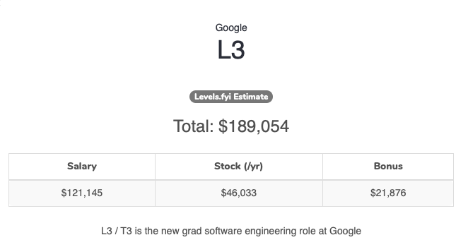

import Emoji from './src/emoji';
import TallImage from './src/tall-image';
import AboutMe from './src/about-me';
export { default as theme } from './src/theme'
import { Appear, Image, Notes } from 'mdx-deck'

# Double your salary with this one simple trick

---
<Image src='https://d2mxuefqeaa7sj.cloudfront.net/s_4BCCC39553ADA99C63657514F94123B76AE4DD2605D4D53BC7464B3EB47ACAE9_1544317331982_always+be+closing.gif' />

---
<AboutMe />
---
# <Emoji name="twitter.png" size={70} /> [@MatthewGerstman](https://twitter.com/MatthewGerstman)
<blockquote class="twitter-tweet" data-lang="en">
My success metric for my talk at <a href="https://twitter.com/ReactNext?ref_src=twsrc%5Etfw">@ReactNext</a> is entirely based on the number of new twitter followers I have by tomorrow.
&mdash; Matthew Gerstman (Slytherin) (@MatthewGerstman) <a href="https://twitter.com/MatthewGerstman/status/1058949042661703680?ref_src=twsrc%5Etfw">November 4, 2018</a></blockquote>

---
<TallImage src='https://d2mxuefqeaa7sj.cloudfront.net/s_4BCCC39553ADA99C63657514F94123B76AE4DD2605D4D53BC7464B3EB47ACAE9_1543689895531_600125_3936450203890_9724516_n.jpg' />

---
<TallImage style={{height: '90vh'}} src='https://d2mxuefqeaa7sj.cloudfront.net/s_4BCCC39553ADA99C63657514F94123B76AE4DD2605D4D53BC7464B3EB47ACAE9_1543691962231_giphy.gif' />

---

# Today We’re Gonna Talk About Salary
---
<TallImage src='https://d2mxuefqeaa7sj.cloudfront.net/s_4BCCC39553ADA99C63657514F94123B76AE4DD2605D4D53BC7464B3EB47ACAE9_1543701527575_giphy-4.gif' />

---
<TallImage src='https://d2mxuefqeaa7sj.cloudfront.net/s_4BCCC39553ADA99C63657514F94123B76AE4DD2605D4D53BC7464B3EB47ACAE9_1543699696940_tenor.gif' />

---
<TallImage src='https://d2mxuefqeaa7sj.cloudfront.net/s_4BCCC39553ADA99C63657514F94123B76AE4DD2605D4D53BC7464B3EB47ACAE9_1543699717270_dobby+sock.gif' />

---
# Why is this so important?
| **Level** | **Salary** |
| --------- | --- |
| 2         | $80,000    |
| 1         | $90,000    |
| 3         | $120,000   |
| 2         | $140,000   |
| 3         | $150,000   |
| 3         | $180,000   |

---
# Negotiations are asymetrical

---
# How you're looking at this negotation 
<ul>
  <Appear>
    <li>That's a lot of money.</li>
    <li>Am I really worth that much?</li>
    <li>What if they cancel the offer?</li>
    <li>That money has to come from somewhere.</li>
  </Appear>
</ul>
---
# How they're looking at this negotation
<ul>
  <Appear>
    <li>I need to close this candidate.</li>
    <li>I need to close this candidate.</li>
    <li>I need to close this candidate.</li>
    <li>I wonder what's for lunch today.</li>
    <li>I need to close this candidate.</li>
    <li>It's not like it's my money</li>
    <li>I need to close this candidate.</li>
  </Appear>
</ul>

---
# I'm going to tell you the first secret of negotiating
---

<TallImage src="assets/are-you-ready-tswift.gif" />

---
# It's a lot more money to you than it is to them.
---
<TallImage src='https://d2mxuefqeaa7sj.cloudfront.net/s_4BCCC39553ADA99C63657514F94123B76AE4DD2605D4D53BC7464B3EB47ACAE9_1543701083185_always.gif' />

---
# It's a lot more money to you than it is to them.
---

# Here's what goes through your head when you ask for five grand.

<ul>
  <Appear>
    <li>Damn, even after taxes that’s a whole vacation.</li>
    <li>Five thousand dollars.</li>
    <li>Seriously, Five thousand dollars.</li>
    <li>It would be so very, very greedy of me to ask for five whole thousand dollars.</li>
  </Appear>
</ul>
---
# What they're thinking
<ul>
  <Appear>
    <li>That's it?</li>
    <li>I'm going to tell them I have to ask my boss so they sign quicker when I say yes</li>    
  </Appear>
</ul>

---
# Appeal to Authority
---
<TallImage src="assets/parents-permission.gif" />
---
# Next Secret

---

<TallImage src="assets/are-you-ready-dodgeball.gif" />
---

# Don’t talk money until they’re ready to give you an offer
---
# Hard mode: Get them to say a number first.
---
# Any number you say will be an immediate upper bound; any number they say will be a lower bound.
---
# They will chip away at that number throughout the interview process
---
<TallImage src='assets/change-subject-alice.gif' />
---
<TallImage src='assets/change-subject-who.gif' />
---
# Magic words: Let's wait to see if this is a good fit before we discuss comp.
---
# Next Secret
---
<Image src="assets/my-body-is-ready.gif" />
---
# Practice saying that biggest number you can with a straight face. 
---
<TallImage src='https://d2mxuefqeaa7sj.cloudfront.net/s_4BCCC39553ADA99C63657514F94123B76AE4DD2605D4D53BC7464B3EB47ACAE9_1543702618055_careerbuilder-original-3396.gif' />

---
# Leverage
---

# Their goal is to close you, anything that can prevent that is leverage.
---
# Things you can do to get leverage
---
# Have a counter offer
---
# Express concern about anything intangible: Start date, team, etc.
<Notes>Even if you're okay with it make them think you're giving them something</Notes>
---
# Have a counter offer
---
# Still be actively interviewing elsewhere
---
# Have a counter offer
---

<TallImage src='https://www.hunted.com/blog/wp-content/uploads/2016/04/counter.gif' />

---

# Let's talk compensation

---

---
# Total compensation
---
# Base Salary
---

# Stock Options
---
<TallImage src='https://media.giphy.com/media/l2YWF00ZX8wOs0p0s/giphy.gif' />
---

<TallImage src='assets/lottery.gif' />
---

# Stock options are the _option_ to buy stock in the future for today's price
---
# Example: 10,000 Options
---
# Strike Price
The price you pay per share
$0.10
---
# IPO day
Company is now worth $100/share
---
# $100 * 10,000
---
<TallImage src='https://d2mxuefqeaa7sj.cloudfront.net/s_4BCCC39553ADA99C63657514F94123B76AE4DD2605D4D53BC7464B3EB47ACAE9_1543702618055_careerbuilder-original-3396.gif' />
---
# Exercising your options
$0.10 * 10,000 = $1,000
---
# Warning: Taxes
* You're going to pay taxes on the $999,000
* Make sure you can actually sell your options when you exercise them
---
# Vesting
* The process of getting your shares.
* Standard deal is 1/4 of shares after 1 year.
* If you join Jan 1, 2019, on Jan 1, 2020 you'll get 2,500 shares.
* After that it vests on some regular cadence (usually quarterly).
---

# Shares (RSUs)
* These are worth somethign as soon as you get them!
* Hopefully the company is public and you can sell them
* They usually vest the same way as options
---
# Bonuses

Signing
Yearly - usually a percentage of your salary

---
# Funding

* Seed
* Series A
* Series B

---
# What are we optimizing for?

Happiness
Money !== Happiness
Money === Comfort

---
# What else is important?

<ul>
  <li>PTO</li>
  <li>Company Culture</li>
  <li>Work Life/Balance</li>
  <li>Benefits</li>
  <li>Parental Leave</li>
  <li>My kid is sick, can i work from home?</li>
  <li>Do you want to live there?</li>
  <li>Commute?</li>
  <li>How much are you going to learn?</li>
</ul>  

---
# Are there any moral quandaries with the work you're doing?
---

<TallImage src='https://d2mxuefqeaa7sj.cloudfront.net/s_4BCCC39553ADA99C63657514F94123B76AE4DD2605D4D53BC7464B3EB47ACAE9_1543703688938_giphy.gif' />
---
<TallImage src='https://d2mxuefqeaa7sj.cloudfront.net/s_4BCCC39553ADA99C63657514F94123B76AE4DD2605D4D53BC7464B3EB47ACAE9_1543703713075_KpMuFUi.gif' />

---
# References
1. https://www.kalzumeus.com/2012/01/23/salary-negotiation/
2. https://levels.fyi
---
<AboutMe />