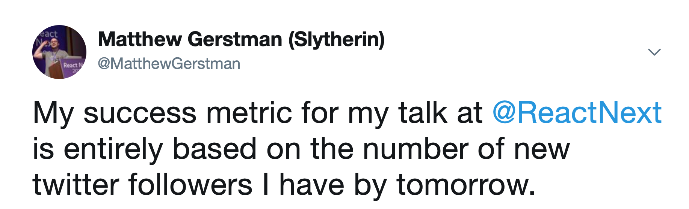
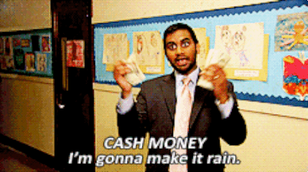
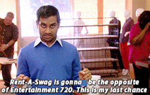
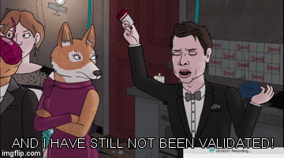

export { default as theme } from './src/theme'
import Emoji from './src/emoji';
import TallImage from './src/tall-image';
import AboutMe from './src/about-me';
import { Appear, Image, Notes } from 'mdx-deck'
import {darkGreen} from './src/colors';

import { Head } from 'mdx-deck'

<Head>
  <title>Double your salary</title>
</Head>

# Double your salary with this one simple trick

---
<Image src='assets/my-offer.gif' />
<Notes>
  I don't know what you're making, I can't promise to double your salary.
</Notes>
---
# Salary Negotiations

<ul>
  <Appear>
    <li>📊 How Stock Works</li>
    <li>💸 Startup Fundraising</li>
  </Appear>
</ul>
---
<AboutMe />
---
# <Emoji name="twitter.png" size={90} /> [@MatthewGerstman](https://twitter.com/MatthewGerstman)

---
<TallImage src='assets/dad.jpg' />
<Notes>
  <ul>
    <li>6'4"</li>
    <li>He's having a bad day when he only lifts once</li>
    <li>Recently had pneumonia and was mad he couldn't go to the gym</li>
    <li>He can probably take Ken Wheeler, sorry ken</li>
    <li>Also a real estate agent</li>
  </ul>
</Notes>
---
<Image src='assets/negotiate-grades.gif' />

---
# We Need to Talk About Salary
---
<TallImage src='https://d2mxuefqeaa7sj.cloudfront.net/s_4BCCC39553ADA99C63657514F94123B76AE4DD2605D4D53BC7464B3EB47ACAE9_1543699696940_tenor.gif' />

---
<TallImage src='https://d2mxuefqeaa7sj.cloudfront.net/s_4BCCC39553ADA99C63657514F94123B76AE4DD2605D4D53BC7464B3EB47ACAE9_1543701527575_giphy-4.gif' />

---
<TallImage src='https://d2mxuefqeaa7sj.cloudfront.net/s_4BCCC39553ADA99C63657514F94123B76AE4DD2605D4D53BC7464B3EB47ACAE9_1543699717270_dobby+sock.gif' />

---

  # Why is this so important?
 

  | **Level** | **Salary** |
  | --------- | --- |
  | Mid       | $80,000    |
  | Junior    | $90,000    |
  | Senior    | $120,000   |
  | Mid       | $140,000   |
  | Senior    | $150,000   |
  | Senior    | $180,000   |

<Notes>
  These are real salaries from a company on glassdoor
</Notes>

---
# Negotiations are asymetrical

<Notes>
  Let's talk about how you think about it versus how they think about it
</Notes>
---
# How you're looking at this negotation 

<ul>
  <Appear>
    <li>🤑 That's a lot of money.</li>
    <li>🤔 Am I really worth that much?</li>
    <li>😕 What if they cancel the offer?</li>
    <li>🤐 That money has to come from somewhere.</li>
  </Appear>
</ul>

<Notes>
  <ul>  
    <li>🤑 That's a lot of money.</li>
    <li>🤔 Am I really worth that much?</li>
    <li>😕 What if they cancel the offer?</li>
    <li>🤐 That money has to come from somewhere.</li>  
  </ul>
</Notes>

---

  # How they're looking at this negotation
  

  <ul>
    <Appear>    
      <li>️️️️✍️ I need to close this candidate.</li>
      <li>🥪 I wonder what's for lunch today.</li>
      <li>✍️ I need to close this candidate.</li>    
      <li>💰 I'm not spending my own money; I'm spending TechCompany's money.</li>
      <li>✍️ I need to close this candidate.</li>    
    </Appear>
  </ul>

<Notes>
  <ul>    
    <li>️️️️✍️ I need to close this candidate.</li>
    <li>🥪 I wonder what's for lunch today.</li>
    <li>✍️ I need to close this candidate.</li>    
    <li>💰 I'm not spending my own money; I'm spending TechCompany's money.</li>
    <li>✍️ I need to close this candidate.</li>        
  </ul>
  If you're ever wondering what your recruiter is thinking, here it is.
</Notes>

---
<TallImage src='assets/always-be-closing.gif' />

---
# I'm going to tell you the first secret of negotiating
---

<TallImage src="assets/are-you-ready-tswift.gif" />

---
# It's a lot more money to you than it is to them.
---
<TallImage src='assets/always.gif' />

---
# It's a lot more money to you than it is to them.
---
# Let's talk about five grand
<Notes>
  Note about picking up 5 grand in a raise vs negotiation.
  Let's do another what you're thinking what they're thinking.
</Notes>
---
# What you're thinking

<ul>
  <Appear>
    <li>🏝 Damn, even after taxes that’s a whole vacation.</li>
    <li>💰 Five thousand dollars.</li>
    <li>💸 Seriously, Five thousand dollars.</li>
    <li>😰 It would be so greedy of me to ask for five whole thousand dollars.</li>
  </Appear>
</ul>
<Notes>
  <ul>  
    <li>🏝 Damn, even after taxes that’s a whole vacation.</li>
    <li>💰 Five thousand dollars.</li>
    <li>💸 Seriously, Five thousand dollars.</li>
    <li>😰 It would be so greedy of me to ask for five whole thousand dollars.</li>
  </ul>
</Notes>
---
<TallImage src="assets/too-much.gif" />
---
# What they're thinking

<ul>
  <Appear>
    <li>😂 That's it?</li>
    <li>🤣 I'm going to tell them I have to ask my boss.</li>    
    <li>🙃 Because then it looks like I'm doing them a favor.</li>
  </Appear>
</ul>
<Notes>
  <ul>
    <li>😂 That's it?</li>
    <li>🤣 I'm going to tell them I have to ask my boss.</li>    
    <li>🙃 Because then it looks like I'm doing them a favor.</li>
  </ul>
</Notes>
---
<TallImage src='assets/jedi-mind-trick.gif' />
---
# Appeal to Authority
---
<TallImage src="assets/parents-permission.gif" />
<Notes>
  <ul>
    <li>They have to ask their boss?</li>
    <li>You have to talk to your family!</li>
    <li>Family can mean literally anything: Spouse, Parent, Sibling, Cat</li>
    <li>They're not allowed to follow up on who your family is</li>
    <li>You want to give them a little bit of hesistation</li>
  </ul>
</Notes>
---
# Next Secret
---
<TallImage src="assets/are-you-ready-tswift-2.gif" />
---

# Don’t talk money until they’re ready to give you an offer
---
# Hard mode

# Get them to say a number first.
---
<Image src="assets/burning-money.gif" />
---

# Any number you say will be an immediate upper bound

# any number they say will be a lower bound.

---
<TallImage src="assets/losing-money.gif" />
<Notes>
  <ul>
    <li>They will chip away at that number throughout the interview process</li>
    <li>So change the subject</li>
  </ul>
</Notes>
---
<TallImage src='assets/manipulating.gif' />
<Notes>
  I'm going to teach you the magic words to delay the conversation
</Notes>
---
<TallImage src='assets/leviosa.gif' />
---
# Let's wait to see if this is a good fit before we discuss comp.
---
# Next Secret
<Notes>
At this point I know you can handle secrets
</Notes>
---
<Image src="assets/my-body-is-ready.gif" />
---
# Practice saying the biggest number you can with a straight face. 
---
<TallImage src='assets/dr-evil.gif' />
---
<TallImage src='assets/you-got-this.gif' />

---
# Leverage
---

# Their goal is to close you

# anything that can prevent that is leverage.
---
<TallImage src='assets/swanson-counter.gif' />
---

  # Things you can do to get leverage
  <ul>
    <Appear>
      <li>💲 Have a counter offer</li>
      <li>🤔 Express concern about anything intangible: Start date, team, etc.</li>
      <li>💲 Have a counter offer</li>
      <li>😎 Still be actively interviewing elsewere</li>
      <li>💲 Have a counter offer</li>
    </Appear>
  </ul>

<Notes>
  <ul>
    <li>🤔 Even if you're okay with it make them think you're giving them something</li>
    <li>😎 Tech companies are full of themselves, they think if you can pass their interview you can pass anyone's</li>
  </ul>
</Notes>
---

---
# Let's talk compensation
---
# Total compensation

<Notes>
  <ul>
    <li>Real Google salary for a newgrad</li>
    <li>top school, two internships</li>
    <li>Bootcamp grads, you need two years of experience</li>
    <li>You should be focused on learning as much as possible</li>
  </ul>
</Notes>
---
# Base Salary
---
<TallImage src='assets/ron-eating.gif' />
<Notes>
This is what puts food on the table
</Notes>
---
# Stock Options
---
<TallImage src='assets/mean-girls-limit.gif' />
---
<TallImage src='assets/lottery.gif' />
---
# Stock options are the _option_ to buy stock in the future for today's price
---
# Example

# 10,000 Options
---
# Strike Price

  # The price you pay per share
  # Example Price: $0.10 per share

---
# IPO day

  # Company is now worth $100 per share

---

<TallImage src='assets/dr-evil.gif' />
---
# Exercising your options

$0.10 * 10,000 = $1,000
---
# 🚨 Taxes

<ul>
  <li>You're going to pay taxes on the $999,000.</li>
  <li>Make sure you can actually sell your options when you exercise them!</li>
</ul>

<Notes>
On the bright side you get to play the taxpayer card more often
</Notes>
---
<TallImage src='assets/taxpayer.gif'/>
<Notes>
But lets talk about how you actually get the shares
</Notes>
---

  # Vesting
  

  <ul>
    <li>The process of getting your shares.</li>
    <Appear>      
      <li>Standard deal is 1/4 of shares after 1 year.</li>
      <li>You join 01/01/2019, on 01/01/2020 you'll get 2,500 shares.</li>
      <li>After that it vests on some regular schedule (usually quarterly).</li>
    </Appear>
  </ul>

---
# Shares (RSUs)

<ul>
  <li>These are worth something as soon as you get them!</li>
  <li>Hopefully the company is public and you can sell them.</li>
  <li>They usually vest the same way as options.</li>
</ul>
---
# Bonuses

<ul>
  <li>Signing - One time bonus for joining.</li>
  <li>Yearly - Usually a percentage of your salary.</li>
</ul>
---
<TallImage src='assets/cartman-money.gif' />
<Notes>
  All of that was total compensation.
  Let's talk a bit about how funding works.
</Notes>
---
# Startup Funding

<ul>
  <li>🙅‍♀️ Seed</li>
  <li>🤷‍♀️ Series A</li>
  <li>💁‍♀️ Series B+</li>
</ul>

---
# 🙅‍♀️ Seed

---
# 🤷‍♀️ Series A

---
# 💁‍♀️ Series B+

---
# What are we optimizing for?

<ul>
  <Appear>
    <li>😄 Happiness</li>
    <li>🤑 Money !== 😄 Happiness</li>
    <li>🤑 Money === 🙃 Comfort</li>
  </Appear>
</ul>

---

# What else is important?

  <ul>
    <Appear>
      <li>👩‍🏫 How much are you going to learn?</li>      
      <li>🚴‍♀️Work Life/Balance</li>
      <li>🏝 PTO</li>      
      <li>👩‍👩‍👦 Parental Leave</li>
      <li>🤕 My kid is sick, can i work from home?</li>
      <li>🚃 Commute?</li>
      <li>🏙 Do you want to live there?</li>
    </Appear>
  </ul>  

---
# Are there any moral quandaries with the work you're doing?
---

<TallImage src='assets/swimming-duck.gif' />
---
<TallImage src='assets/swimming-peter.gif' />
---
<TallImage src='assets/learned-something.gif' />
---
<TallImage src='assets/breaking-bad.gif' />
---

  # <Emoji name="twitter.png" size={90} /> [@MatthewGerstman](https://twitter.com/MatthewGerstman)
  
  

  

---
<AboutMe />
---
# References

1. https://www.kalzumeus.com/2012/01/23/salary-negotiation/
2. https://levels.fyi